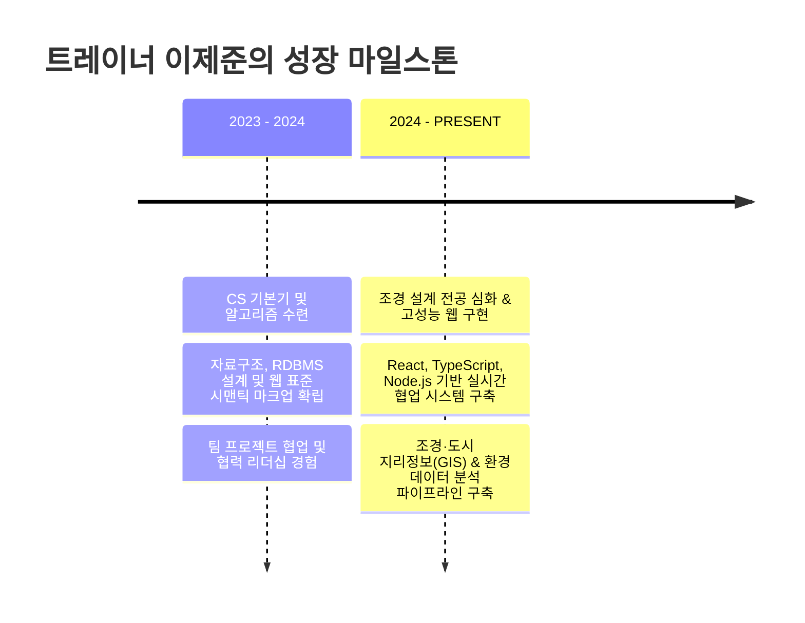

# 🎮 TRAINER LEE JEJUN (이제준) — 포트폴리오 기획 데이터 명세서
> **문서 버전:** v1.0.0  
> **용도:** AI 및 개발자가 포트폴리오 웹사이트/대시보드 콘텐츠로 직접 파싱하고 기재하기 위한 정형화된 데이터 명세서  
> **기획자 정리 일자:** 2026.09.15  

---

## 1. 기본 프로필 정보 (Profile & Persona)

| 항목 | 내용 |
| :--- | :--- |
| **이름** | 이제준 (Lee Jejun) |
| **소속** | 상명대학교 천안캠퍼스 조경학과 (3학년) |
| **핵심 포지션** | 조경 설계 · 공간 데이터 시각화 (Landscape Design & Spatial Data Visualization) |
| **주요 거점** | 충청남도 천안시 동남구 안서동 상명대길 |
| **연락처 (Phone)** | `010-4677-2417` |
| **이메일 (Email)** | `dvae1456@gmail.com` |
| **GitHub** | [https://github.com/JeJunLee-jj](https://github.com/JeJunLee-jj) (저장소: `JeJunLee-jj`) |
| **콘셉트 & 세계관** | **포켓몬 트레이너 코드 도감 (Developer Dex & Gym Badges)** |
| **트레이너 레벨** | `Lv.24 (JEJUN.DEX NO. 2026-JJL)` |

---

## 2. 핵심 슬로건 및 소개 문구 (Bio & Value Proposition)

### 🎯 메인 슬로건 (Hero Title)
> **"새로운 가치를 포획하는 조경학도, 이제준입니다."**  
> *(Sub: ▶ 야생의 조경학도가 나타났다!)*

### 📝 자기소개 (Intro Pitch)
> 상명대학교 천안캠퍼스 조경학과에서 녹지와 공간을 설계하고, 도시가 쏟아내는 데이터를 명쾌하고 유쾌한 화면으로 옮깁니다.  
> 단순한 기능 구현을 넘어 직관적인 인터랙션, 견고한 데이터 모델링, 60fps의 매끄러운 성능 최적화를 지향합니다.

---

## 3. 핵심 기술 역량 매트릭스 (8대 체육관 스킬 배지)

| 배지 No. | 배지 명칭 | 핵심 기술 스택 | 숙련도 & 역량 상세 설명 |
| :---: | :--- | :--- | :--- |
| **#01** | **썬더 배지 (Thunder)** | `JavaScript (ES6+)`, `TypeScript` | 비동기 이벤트 루프 정밀 제어, 정적 타입 기반의 안정적이고 결함 없는 코드베이스 구축 |
| **#02** | **파이어 배지 (Fire)** | `React`, `Next.js` | 선언적 컴포넌트 아키텍처, 커스텀 훅 최적화, SSR/SSG 하이브리드 렌더링 파이프라인 |
| **#03** | **워터 배지 (Water)** | `Node.js`, `Express` | 유연하고 견고한 RESTful API 설계, 미들웨어 체인 구성, 실시간 양방향 파이프라인 |
| **#04** | **리프 배지 (Leaf)** | `Python`, `Landscape` | 조경·환경 도메인 지식, 센서 시계열 데이터 가공, 통계 모델링 및 자동화 |
| **#05** | **에스퍼 배지 (Psychic)** | `PostgreSQL`, `MySQL` | 관계형 데이터베이스 정규화(3NF), 인덱스 튜닝, 복잡한 쿼리 최적화 및 트랜잭션 관리 |
| **#06** | **스틸 배지 (Steel)** | `Git / GitHub`, `CI/CD` | 체계적인 Git-Flow 브랜칭 전략, 자동화 배포 파이프라인을 통한 무중단 릴리스 |
| **#07** | **록 배지 (Rock)** | `HTML5`, `Modern CSS3` | 시맨틱 웹 표준 준수, 크로스 브라우징, CSS 애니메이션을 통한 60fps 반응형 UI |
| **#08** | **드래곤 배지 (Dragon)** | `System Architecture` | 단일 책임 원칙(SRP)과 모듈화 기반 확장 가능한 클라이언트-서버 구조 설계 |

---

## 4. 대표 프로젝트 도감 (Code-Dex Archive)

### 📌 Project #001: Nexus Campus
- **도감 번호:** `DEX #001`
- **속성:** ⚡ Electric (웹 구현)
- **부제:** 천안 대학가 올인원 라이프사이클 플랫폼
- **진행 기간:** `2024.03 — 2024.07`
- **기술 스택:** `React`, `Node.js`, `Express`, `PostgreSQL`, `Kakao Maps API`
- **프로젝트 개요:**
  천안 안서동 대학가 학생들의 학기 초 시간표 작성 복잡성과 분산된 상권/학업 정보 탐색 비용을 해소하기 위한 올인원 캠퍼스 플랫폼.
- **주요 해결 과제 (Challenge & Solution):**
  - **문제:** 기존 서비스의 복잡한 UI와 수작업 시간표 조합으로 인한 높은 사용자 이탈률.
  - **해결:** 드래그 앤 드롭 방식의 직관적 인터랙티브 시간표 빌더 구현 및 반경 기반 캠퍼스 지도 필터링 결합.
- **정량적 성과 & 스펙:**
  - 탐색 및 시간표 완성 소요 시간 **70% 단축**
  - 가상 DOM 메모이제이션 최적화로 다중 강의 렌더링 랙 제거
  - 교내 비공개 베타 테스트 **DAU 200+** 달성

---

### 📌 Project #002: DevSync
- **도감 번호:** `DEX #002`
- **속성:** 💧 Water (실시간 협업)
- **부제:** 실시간 마크다운 & 코드 협업 엔진
- **진행 기간:** `2024.08 — 2024.11`
- **기술 스택:** `TypeScript`, `React`, `WebSocket`, `CodeMirror 6`, `CRDT (Yjs)`
- **프로젝트 개요:**
  다수의 원격 개발자가 브라우저 환경에서 문서 동시 편집과 코드 블록 인터랙티브 실행을 단일 화면에서 수행할 수 있는 테크니컬 협업 에디터.
- **주요 해결 과제 (Challenge & Solution):**
  - **문제:** 문서 작성 도구와 코드 실행 환경의 분리로 인한 잦은 화면 전환 및 컨텍스트 스위칭 비용.
  - **해결:** CRDT(무충돌 복제 데이터 타입) 동기화 엔진과 브라우저 인-메모리 코드 샌드박스를 통합 지원.
- **정량적 성과 & 스펙:**
  - WebSocket 동기화 지연시간 **50ms 미만** 유지
  - 가상 뷰포트 렌더링 도입으로 대용량 문서 편집 시 메모리 점유율 **45% 절감**
  - Google Lighthouse 성능 지표 **98점** 획득

---

### 📌 Project #003: Green City AI Hub
- **도감 번호:** `DEX #003`
- **속성:** 🌿 Grass (조경 / 환경 데이터)
- **부제:** 도시 환경 센서 데이터 & 녹지 분석 대시보드
- **진행 기간:** `2024.09 — 2025.01`
- **기술 스택:** `Python`, `FastAPI`, `React`, `Chart.js`, `GeoJSON`
- **프로젝트 개요:**
  상명대 조경학과 전공 지식을 기반으로 도시 미기후 센서, 녹지 지수, 에너지 소비 패턴을 한눈에 모니터링하는 지능형 관제 대시보드.
- **주요 해결 과제 (Challenge & Solution):**
  - **문제:** 다변량 시계열 센서 데이터의 방대한 양으로 인한 대시보드 로딩 지연 및 직관적 시각화 부족.
  - **해결:** GeoJSON 기반의 구역별 히트맵(Heatmap)과 비동기 시계열 집계 차트를 결합해 3초 이내 현황 파악 환경 구축.
- **정량적 성과 & 스펙:**
  - 서버 측 인메모리 캐싱 파이프라인으로 **100,000건+** 센서 로그 조회 시 초기 렌더링 속도 **65% 개선**
  - 이상 기후/미세먼지 급증 구간 조기 감지 알림 모듈 탑재

---

### 📌 Project #004: FlowTask
- **도감 번호:** `DEX #004`
- **속성:** 🔮 Psychic (생산성 / 알고리즘)
- **부제:** 스마트 우선순위 분석 칸반 보드
- **진행 기간:** `2024.12 — 2025.03`
- **기술 스택:** `Vanilla JavaScript (ES6+)`, `HTML5 Drag & Drop API`, `Chart.js`, `LocalStorage API`
- **프로젝트 개요:**
  아이젠하워 매트릭스 알고리즘을 인터랙티브 칸반 보드에 접목하여 실시간 중요도·긴급도 분석을 지원하는 초경량 태스크 매니저.
- **주요 해결 과제 (Challenge & Solution):**
  - **문제:** 무거운 서드파티 라이브러리 의존성으로 인한 로딩 속도 저하 및 단순 체크리스트형 Todo의 우선순위 왜곡.
  - **해결:** 순수 Vanilla JS와 HTML5 네이티브 드래그앤드롭 API만을 사용해 0KB 번들 및 완전 오프라인 구동 실현.
- **정량적 성과 & 스펙:**
  - 외부 프레임워크 0개 의존, 순수 브라우저 API 기반 **네이티브 60fps** 드래그 모션 완성
  - 데이터 유실 방지를 위한 로컬 트랜잭션 자동 동기화 및 생산성 통계 레이더 차트 지원

---

## 5. 성장 여정 및 마일스톤 (Adventure Chronicle)



---

## 6. 포트폴리오 웹사이트 인터랙션 명세 (UI/UX Features)
AI가 웹페이지를 재구성하거나 신규 템플릿을 빌드할 때 유지해야 하는 핵심 기능 요소입니다:

1. **8-Bit 사운드 신시사이저 (Web Audio API)**:
   - 외부 음원 파일 없이 브라우저 오디오 오실레이터를 통해 레트로 포켓몬 효과음(클릭, 승리 사운드, 에러 사운드) 자체 생성.
2. **3D 홀로그램 트레이너 패스포트 카드**:
   - 마우스 커서 위치에 따른 실시간 3D 틸트(Tilt) 및 회절 반사(Glir/Shine) 이펙트.
3. **속성별 실시간 도감 필터링**:
   - `전체 [4]`, `전기 (웹)`, `물 (협업)`, `풀 (조경·환경)`, `에스퍼 (생산성)` 탭 즉시 전환.
4. **원클릭 클립보드 복사 엔진**:
   - 전화번호(`010-4677-2417`) 및 이메일(`dvae1456@gmail.com`) 클릭 시 즉시 복사 및 레트로 토스트 팝업 송출.
5. **주간/야간 모드 (Day / Night Route Engine)**:
   - 레트로 픽셀 테마와 모던 다크/라이트 테마 전환 지원.

---

## 7. AI 웹사이트 생성/수정용 JSON 데이터 블록
웹 빌더 AI 또는 컴포넌트 프레임워크에서 즉시 import하여 렌더링할 수 있는 구조화된 JSON 데이터입니다:

```json
{
  "trainer": {
    "name": "이제준",
    "nameEn": "Lee Jejun",
    "university": "상명대학교 천안캠퍼스",
    "major": "조경학과",
    "grade": "3학년",
    "role": "Landscape Architecture Student / Spatial Data Visualization",
    "level": "Lv.24",
    "contact": {
      "phone": "010-4677-2417",
      "email": "dvae1456@gmail.com",
      "github": "https://github.com/JeJunLee-jj",
      "location": "충청남도 천안시 동남구 상명대길"
    },
    "bio": "상명대학교 천안캠퍼스 조경학과에서 녹지와 공간을 설계하고, 도시가 쏟아내는 데이터를 명쾌하고 유쾌한 화면으로 옮깁니다."
  },
  "projectsCount": 4,
  "badgesCount": 8,
  "projects": [
    {
      "id": "dex-001",
      "title": "Nexus Campus",
      "subtitle": "천안 대학가 올인원 라이프사이클 플랫폼",
      "type": "electric",
      "period": "2024.03 - 2024.07",
      "tech": ["React", "Node.js", "Express", "PostgreSQL", "Kakao Maps"]
    },
    {
      "id": "dex-002",
      "title": "DevSync",
      "subtitle": "실시간 마크다운 & 코드 협업 엔진",
      "type": "water",
      "period": "2024.08 - 2024.11",
      "tech": ["TypeScript", "React", "WebSocket", "CodeMirror", "CRDT"]
    },
    {
      "id": "dex-003",
      "title": "Green City AI Hub",
      "subtitle": "도시 환경 센서 데이터 & 녹지 분석 대시보드",
      "type": "grass",
      "period": "2024.09 - 2025.01",
      "tech": ["Python", "FastAPI", "React", "Chart.js", "GeoJSON"]
    },
    {
      "id": "dex-004",
      "title": "FlowTask",
      "subtitle": "스마트 우선순위 분석 칸반 보드",
      "type": "psychic",
      "period": "2024.12 - 2025.03",
      "tech": ["Vanilla JS", "HTML5 DnD", "Chart.js", "LocalStorage"]
    }
  ]
}
```

